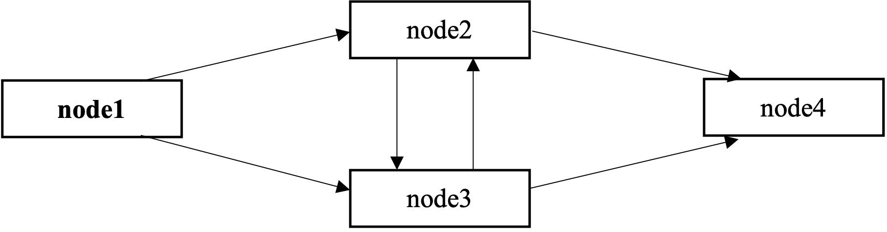

# Dijkstra-Scholten Algorithm
Modeling and Verification of Dijkstra-Scholten Algorithm using [*Spin*](http://spinroot.com)

## Formulation of the Problem
The [*Dijkstra-Scholten Algorithm*](https://en.wikipedia.org/wiki/Dijkstra–Scholten_algorithm) is an algorithm for detecting termination in a distributed system.
In our case, a distributed system consists of 4 nodes, where node 1 is an *environment* node:


It is needed to do the following:
* Model the Algorithm using *Promela* language
* Verify the Algorithm in *Spin*

## Simulation
The Algorithm consists of 3 types of processes:
1. The process for the environment node that can only *send messages* and *receive signals*
2. The process for other nodes, that in addition can also *receive messages* and *send signals*
3. The *init* process that runs the other ones

## Verification
This Algorithm must satisfy two properties: *Safety* and *Liveness*:
* The *Safety* property guarantees that the system announces termination only when all nodes have terminated
* The *Liveness* property ensures that if all nodes have terminated, then the system will eventually announce termination

All properties are represented as ltl-formulas.

## Getting Started
1. Go to Spin directory and run:
```
./ispin.tcl Dijkstra_Scholten.pml
```
2. On the *Simulate / Replay* tab, set the maximum number of steps to 10000
3. On the *Verification* tab in the *Advanced Parameters*, set the maximum search depth equal to 10<sup>7</sup> steps

